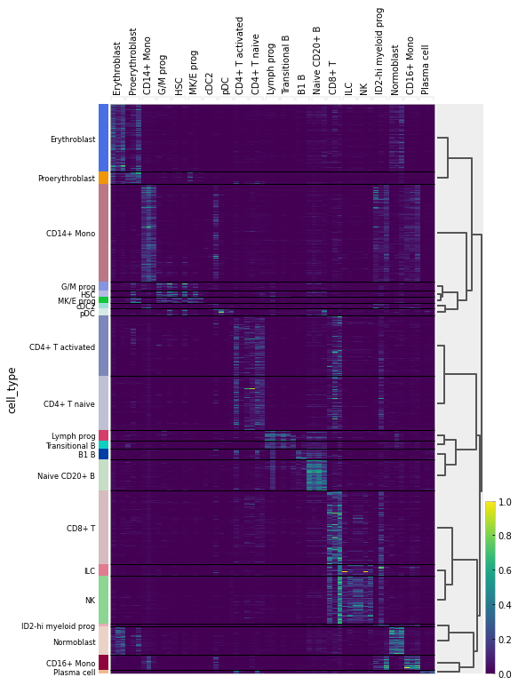
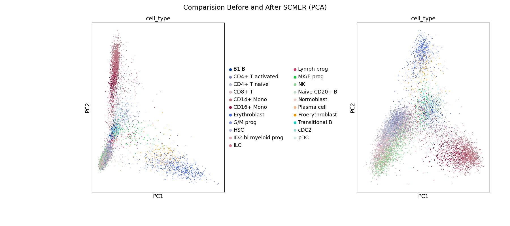
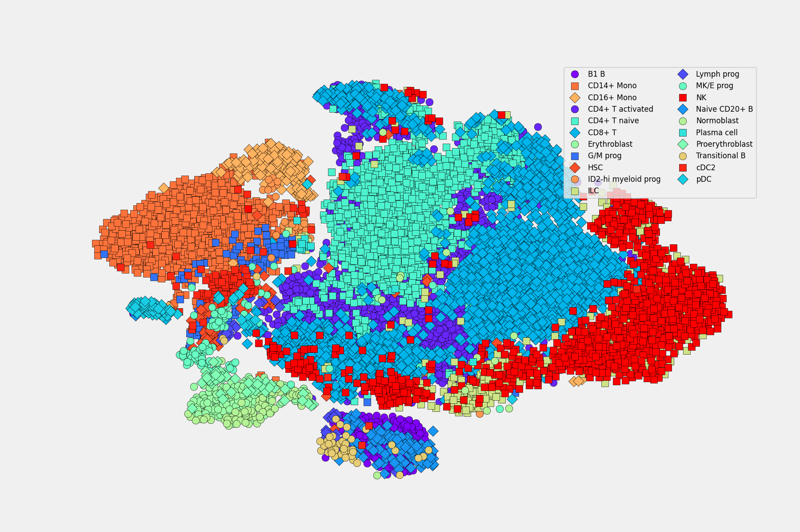

# Description of this portfolio

This portfolio contains my notebooks about machine and deep learning algorithms applied on **single-cell RNA-seq data**. This data was downloaded from [NeuroIPS 2021](https://openproblems.bio/neurips_docs/). These notebooks are described below: 

## 1.  [scRNA-seq 🧬: Differential Expression with scVI](notebooks/scrna-seq-differential-expression-with-scvi.ipynb) (see it in action at [Kaggle](https://www.kaggle.com/hiramcho/scrna-seq-differential-expression-with-scvi))
**Linearly decoded VAE** ([LDVAE](https://docs.scvi-tools.org/en/stable/tutorials/notebooks/linear_decoder.html)) is a generative model similar to PCA which can be used similarly as [scVI](https://docs.scvi-tools.org/en/stable/tutorials/notebooks/api_overview.html), however, due that it has linear functions instead of neural networks it's more easy to interpret its ouput. In this notebook i used this model to get **differential expression analysis**.  
  

## 2. [scRNA-seq 🧬: Scanpy & SCMER for Feature Selection](notebooks/scrna-seq-scanpy-scmer-for-feature-selection.ipynb) (see it in action at [Kaggle](https://www.kaggle.com/hiramcho/scrna-seq-scanpy-scmer-for-feature-selection))

[SCMER](https://scmer.readthedocs.io/en/latest/) (single-cell manifold-preserving feature
selection) was used in notebook to get a compact version of the full dataset. I also do some visualizations and i have to admit that is too easy to use with [Scanpy](https://scanpy.readthedocs.io/en/stable/index.html), once you have your data in form of `adata` object.

## 3. [scATAC-seq 🧬: EpiScanpy & PeakVI](notebooks/scrna-seq-scgae-with-spektral-and-rapids.ipynb) (see it in action at [Kaggle](https://www.kaggle.com/hiramcho/scrna-seq-scgae-with-spektral-and-rapids))

After some practice with SCMER i decided to use it to get a matrix that i could handle to train **graph neural networks** and only 13GB RAM. The GNN used is [scGAE](https://www.nature.com/articles/s41598-021-99003-7), a recently published model on Nature. scGAE performs clustering on its **latent space** and it can be used for downstram analysis.  

**Contact**: hiramcoria@gmail.com